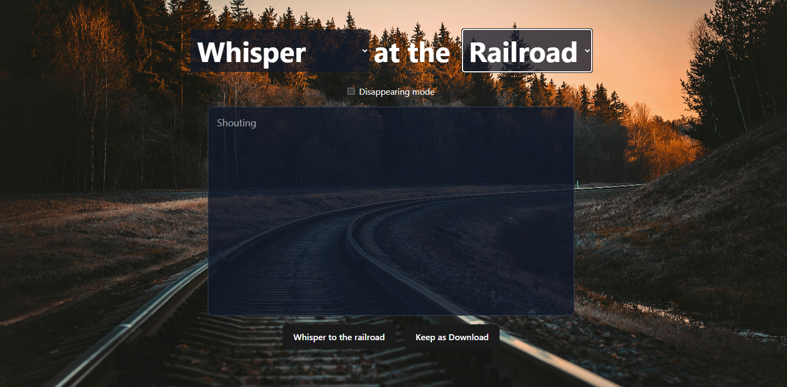
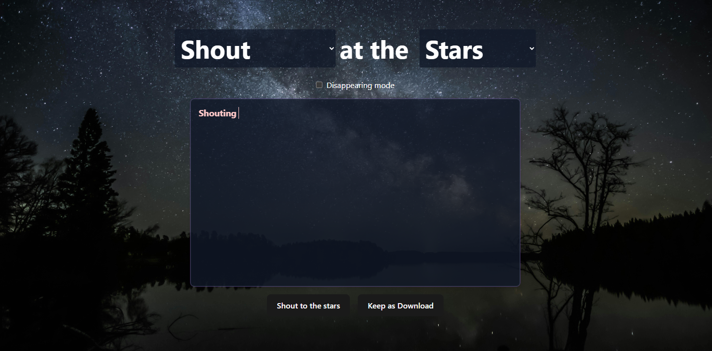
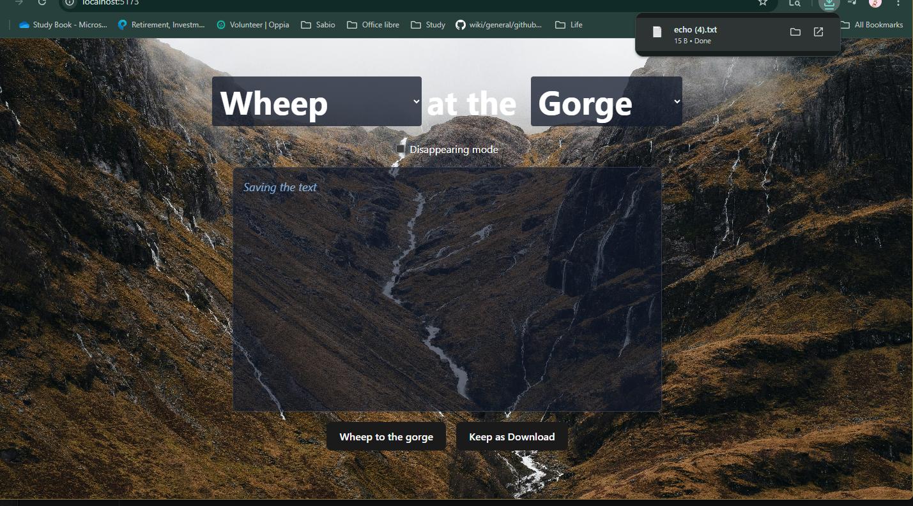

# Echos
**`Full Stack Project`**

This project was inspired by my own experience with pregnancy loss and was created as a personal way to process grief while offering a safe space for others to do the same. Built with React and Tailwind CSS, the app allows users to customize their experience through background and font changes, release their words instantly  by a button click or let them disappear as typing stops by toggling disappearing mode, and optionally save reflections locally as a .txt file. My goal with this project is to combine thoughtful design with functionality to provide a simple, private outlet for emotional release.

- Developed and tested responsive webpages using Tailwind CSS and React for the frontend.

- Provided drop down selections to change background image and text color & font.

- Options provided to erase text all at once by react scatter effect or toggle automatic character by character elimination.

- Intergrated save feature to store text in a txt file.

